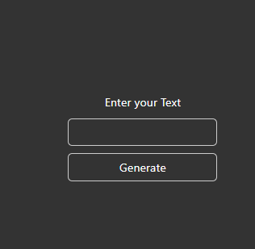
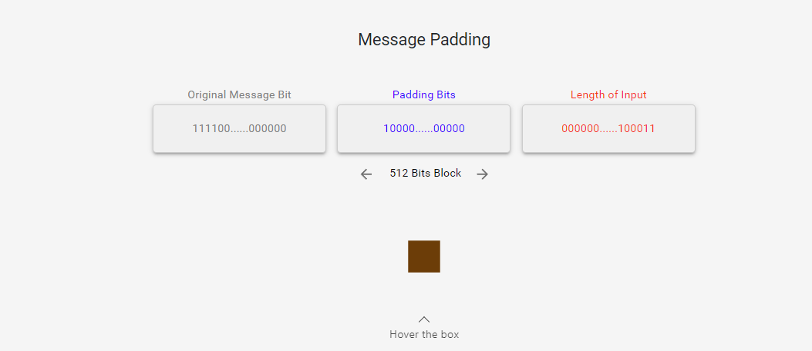
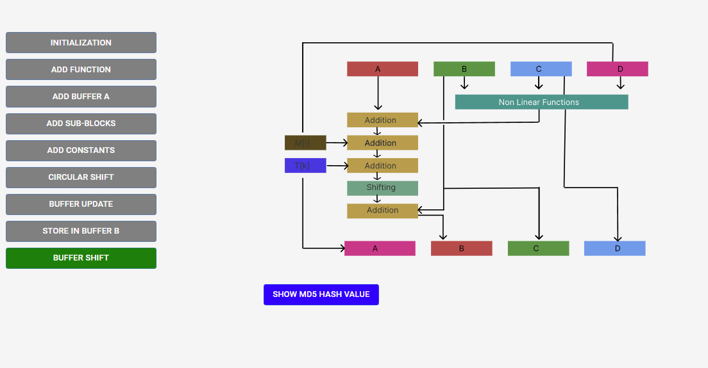
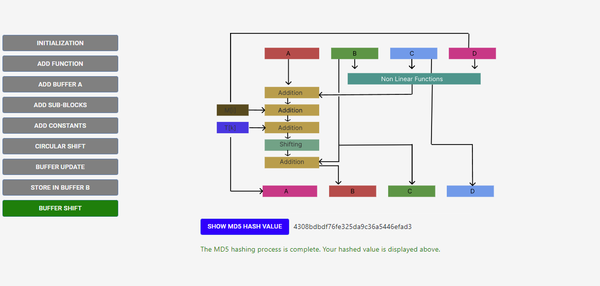

### Procedure

1. Add your value in the input field and click the generate button to start the MD5 hashing process.

2. Read the instructions shown after clicking the submit button.
3. The message padding bits are displayed on the screen. Hover over the box to understand how the padding bits are added.
   

4. Click the Next button to proceed to the final step of the MD5 algorithm.
5. Click the Initialization button to initialize the buffer variables A, B, C, and D.

6. Follow the instructions and click all the other buttons to complete the message chunk processing.

7. Click the Show MD5 Hash Value button to display the final hashing value.

